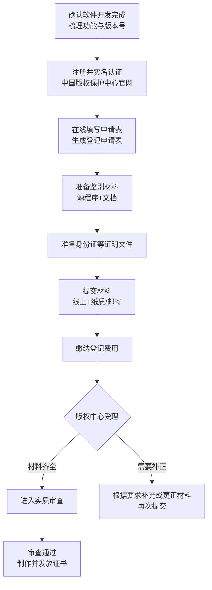

## 软件著作权登记指南（适用于个人与学生）

本指南基于国家版权局公布的《计算机软件保护条例》《计算机软件著作权登记办法》、中国版权保护中心发布的登记指南，以及部分公开的实务经验文章整理，帮助你按最新要求完成软件著作权登记。

***

### 一、软件著作权登记的作用

* 证明你对软件享有著作权，是发生纠纷时的重要法律证据

* 便于升学、评奖、竞赛、项目申报等场景展示创新成果

* 便于以后授权、转让、合作开发等商业使用

著作权本身在软件完成创作时自动产生，但“登记”可以获得权威机构出具的书面证明。

***

### 二、官方机构与办理入口

* 主管机关：国家版权局

* 软件登记机构：中国版权保护中心

* 官方网站：<https://www.ccopyright.com.cn>

* 办理入口：登录官网后选择“计算机软件著作权登记”相关服务

部分地方版权局网站会转载同一套要求，但登记机构仍是中国版权保护中心或其授权办事机构。

***

### 三、需要准备的三大类材料

根据《计算机软件著作权登记办法》第九、十、十一条及登记指南，申请时一般需要：

#### 1. 申请表

* 使用中国版权保护中心统一格式的《计算机软件著作权登记申请表》

* 在线系统填写后生成，不要改动表格结构

* 必须使用中文填写

* 申请人签字或盖章应与表内姓名或名称一致

#### 2. 软件鉴别材料（程序和文档）

这是审查软件原创性的关键材料。

**程序部分（源代码）：**

* 一般要求：

  * 源程序前、后各连续 30 页，共 60 页

  * 若整个程序不足 60 页，则提交全部源程序

  * 除特定情况外，每页不少于 50 行代码

* 统一格式要求：

  * 纸张：A4，纵向，单面打印

  * 字体与字号：以清晰易读为原则，可参考宋体小五

  * 文本从左向右排版

  * 右上角按顺序标注页码

**文档部分（任选一种）：**

* 可以选择：用户手册、设计说明书、使用说明书、技术说明书等任一文档

* 一般要求：

  * 文档前、后各连续 30 页，不足 60 页则提交全文

  * 每页不少于 30 行文字

  * 同样使用 A4 纸、单面打印、右上角编页码

> 如果你的程序和文档总页数都达不到 60 页，按照规定可以直接提交“完整程序”和“完整文档”，不强行凑页数。

#### 3. 证明文件

视申请人身份及软件来源不同，通常包括：

* 自然人申请：身份证复印件（正反面）

* 如存在以下情况，还需提供相应材料：

  * 有开发合同或项目任务书：提交合同或任务书

  * 在已有软件基础上二次开发：提交原著作权人许可证明

  * 继承、受让、承受取得的权利：提交相应法律文书

对一般个人独立开发的软件，只需提供本人身份证复印件即可。

***

### 四、格式与排版要求（重点细节）

综合中国版权保护中心登记指南的要求：

* 所有申请文件统一使用 A4（297mm×210mm）纸张

* 纵向、单面打印，文字自左向右排列

* 源程序和文档一般用黑白打印

* 各部分材料右上角连续编页码

* 申请表、鉴别材料、证明文件中出现的软件名称、版本号应当完全一致

这些细节如果处理不当，可能会被要求补正，延长审查时间。

***

### 五、典型办理流程概览（含流程图）

下面先给出文字版步骤，再用两个简单的流程图帮你从整体和细节理解。

1. 在中国版权保护中心官网注册并完成实名认证
2. 在线填写《计算机软件著作权登记申请表》，生成并下载/打印
3. 按要求整理和打印源程序及文档的鉴别材料
4. 准备身份证等证明文件并按要求排版
5. 按版权保护中心当前要求，通过系统提交或邮寄纸质材料
6. 按收费标准缴纳登记费用
7. 等待受理、审查和制证，留意短信或邮件通知
8. 审查通过后领取或下载登记证书（电子证书具有法律效力，有的情形下可同时获取纸质证书）

实际操作时，以中国版权保护中心网站公布的最新流程和提示为准。

#### 1. 总体流程图（从无到拿证）

#### 2. 鉴别材料准备流程图（代码和文档怎么选）

***

### 六、费用与时间参考（结合实践经验）

1. **官方基础收费**

   * 公开资料普遍提到的软件著作权登记基础费用大约为每件 250 元（程序+一种文档），这是面向中国版权保护中心的收费标准。

   * 如申请中增加多种文档、例外交存等，可能会按照中国版权保护中心或地方版权机构公布的标准另行收费。

2. **审查时间**

   * 从“受理”到出具审查结论，常见描述是**大约 60 个自然日左右**，不含你自己准备材料和邮寄往返时间。

   * 节假日、年底业务高峰期，整体时间可能会延长；若中间被要求补正材料，时间也会顺延。

3. **代理服务与额外费用**

   * 若通过代理机构或平台（例如各类知识产权服务公司）代办，通常需要额外支付服务费，从几百元到数千元不等，取决于服务内容（是否代写文档、是否加急等）。

   * 使用代理不改变版权中心的审查标准，只是由代理帮你整理材料、提交申请。

***

### 七、常见问题与风险点

1. **源代码行数不“够多”会被驳回吗？**

   * 关键是满足“前后各 30 页或全部提交”的页数和行数要求，而不是总行数越多越好。

   * 官方规则是：程序前、后各 30 页，不足 60 页提交全部程序，除特定情况外每页不少于 50 行。文档部分同理。

2. **未完全开发完成的软件可以登记吗？**

   * 实务中，有人会在版本尚未“最终完成”时就登记一个可运行、功能相对稳定的版本，用于先占有权利。但从规范性角度，建议至少保证：

     * 代码结构完整、可被他人理解；

     * 文档能准确描述当前功能。

3. **多人合作开发的软件如何填申请表？**

   * 若存在多个自然人共同开发：

     * 可在申请表中列出多个著作权人；

     * 如有约定比例或权利分配，应签订合作开发协议，必要时一并提交。

   * 若是学校/公司与个人共同开发，注意确定权利归属（单位作品还是个人作品），以免后续产生争议。

4. **常见补正原因**

   * 申请表信息与鉴别材料中的软件名称、版本号不一致；

   * 源代码页数、行数不符合要求，或内容出现大量注释/空行导致有效代码过少；

   * 文档内容过于简单，如只有几页界面截图，没有文字说明；

   * 证明文件不清晰或缺少必要页（身份证未含反面、营业执照未盖章等）。

***

### 八、给个人开发者和学生的实用建议

* 尽量在软件功能比较稳定后再去登记，避免频繁变更版本号

* 源代码和文档排版时保持整洁、有层次，方便审查人员快速理解

* 在不影响理解的前提下，可以脱敏处理敏感信息（如密钥、服务器地址）

* 妥善保留提交材料的电子版本、打印文件和快递凭证，便于后续查证

* 对于准备参加竞赛、评优、升学材料提交的同学，可以预留足够时间（建议预留 4–5 个月），以防补正或高峰期延迟

软件著作权登记不是强制性的，但对于希望证明自己原创成果、保护权益、展示技术能力的个人和学生来说，是一项性价比很高的投入。
